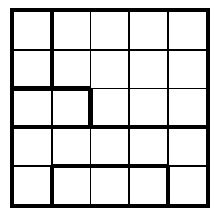

# Star Battle

Star Battle est un puzzle logique avec des règles simples et des solutions stimulantes.

Les règles de Star Battle sont simples :
Vous devez placer des étoiles sur la grille selon ces règles :

* 2 étoiles ne peuvent pas être adjacentes horizontalement, verticalement ou en diagonale.
* Pour les puzzles 1★, vous devez placer 1 étoile sur chaque ligne, colonne et bloc.
* Pour les puzzles 2★, les étoiles par ligne, colonne et bloc doivent être 2, etc.
* Il existe également des puzzles 3★.

## Sites internet

* [Site en français](https://fr.puzzle-star-battle.com/)
* [Vidéo en français](https://www.youtube.com/watch?v=dG-xkOYYkwY)
* [Site en anglais](https://starbattle.puzzlebaron.com/)

## Implémentation

Ce dépôt contient une librairie pour résoudre des grilles de Star Battle.

L'exécutable généré avec le fichier `src/main.rs` permet de résoudre des grille de Star Battle.

Un fichier au format 'texte' est utilisé pour définir la grille initiale.

Dans ce fichier, chaque ligne de texte correspond à une ligne de la grille. Les différentes régions sont identifiées par une 'lettre' distincte dans la case correspondante.

Les lignes 'vides' ou qui commencent par l'un des caractères suivants sont ignorées : '*', '#', '/' (considérées comme d'éventuels commentaires dans le fichier).

Chaque ligne 'utile' de ce fichier doit définir le même nombre de cases. Elles doivent donc toutes avoir la même longueur.

Exemple de grille (grille 1★) :



Cette grille peut être représentée par le contenu suivant dans un fichier texte (5 régions identifiées par les lettres 'A', 'B', 'C', 'D' et 'E') :

```text
# Exemple de grille 1★
ABBBB
ABBBB
CCBBB
DDDDD
DEEED
```

## Syntaxe de la commande 'star-battle'

```cmd
$ cargo run -- --help

STAR BATTLE Usage: ./star-battle <grille> {<nb étoiles>}

<grille> est le nom d'un fichier contenant une grille à résoudre.
<nb_étoiles> est le nombre d'étoiles à placer dans chaque ligne, colonne et région de la grille.
Par défaut, ce nombre d'étoile est 1.

Le fichier <grille> définit chaque région de la grille par un caractère.
Par exemple :

# Exemple de grille 1★ avec 5 régions 'A', 'B', 'C', 'D' et 'E'
ABBBB
ABBBB
CCBBB
DDDDD
DEEED
```
